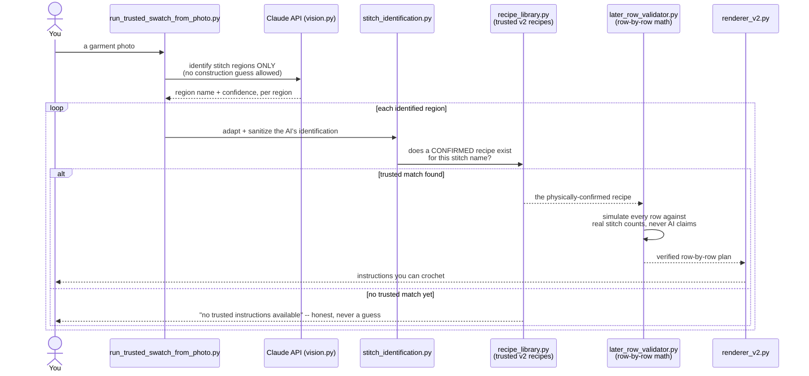

# StitchScope

**Photo in, physically-confirmed instructions out. The AI never gets to author what you crochet.**

## The problem

Vision models are good at recognizing what a crochet stitch pattern *looks like*, and unreliable at reconstructing exactly how it's *built* -- the setup, the repeat, the turning chain, row by row. A model can name a region "filet mesh" with 85% confidence and then propose a repeat structure that isn't actually filet mesh. Reliable naming, unreliable construction -- that gap is the reason this project exists, and it's also a measured, documented gap in current research (see CrochetBench, arXiv:2511.09483).

StitchScope doesn't try to make the AI more reliable at constructing stitches. It assumes the AI's construction proposal is never fully trustworthy on its own, and builds a validation pipeline around that assumption instead.

## How it works



The AI is only ever trusted to say *what a region looks like*. The moment a region needs *how to build it*, the system checks a library of recipes a person has physically crocheted and confirmed against the photo -- and if nothing confirmed exists yet, it says so plainly, rather than rendering the AI's own unverified guess as if it were a real pattern.

## Why this matters (the actual engineering)

- **Two trust levels, never conflated.** "The AI identified this as filet mesh" and "the AI's proposed setup/repeat/turning-chain is correct" are separate claims. Only a human-confirmed recipe is ever rendered as real instructions -- see `engine/recipe_library.py`'s trust boundary.
- **Independent, non-circular validation.** Every row is checked against stitch counts the code computes itself -- never against the AI's own claimed numbers, and never against a count read back from the same proposal being tested. See `engine/swatch.py` and `engine/later_row_validator.py`.
- **Fails loudly, not silently.** An unconfirmed stitch is reported as unconfirmed. A malformed AI response is rejected before it reaches a user. There is no fallback path that quietly renders an unverified guess as if it were trustworthy.
- **Cheap to be wrong, before anything costs money.** Malformed input, an unreadable image, an invalid recipe library -- all rejected before the paid API call is ever made, so a bad request never gets charged for or mistaken for a real result. See `engine/image_swatch_pipeline.py`.

## Tech stack

- Python 3 (standard library, plus `anthropic` for the real vision calls)
- Claude API (vision + structured outputs) for stitch identification
- No external validation frameworks -- the DSL tokenizer, parser, arithmetic validator, and constraint-based sizing solver are all hand-built

## Project layout

| Layer | What it does | Where |
|---|---|---|
| Text DSL | Tokenizes/parses rows written as setup + repeat steps | `engine/tokenizer.py`, `engine/parser.py`, `engine/pattern_reader.py` |
| Arithmetic validator | Checks stitches consumed/produced against what's actually available, row over row | `engine/validator.py`, `engine/later_row_validator.py` |
| Sizing | Solves for the stitch count closest to a target measurement without breaking the repeat | `engine/sizing.py` |
| Vision | Two separate Claude API calls: identify a stitch region (no numbers), then ask generically how that named stitch is conventionally built | `engine/vision.py`, `engine/stitch_identification.py` |
| Trust boundary | Resolves an identified stitch against a library of physically-confirmed recipes; nothing else is ever rendered as real instructions | `engine/recipe_library.py`, `engine/swatch_planner_v2.py` |
| Rendering | Turns a verified structure back into plain-English instructions | `engine/renderer.py`, `engine/renderer_v2.py` |
| Contracts | JSON Schemas enforcing every AI response's shape | `contracts/` |

## Running it

```bash
git clone https://github.com/gharteykeziah/StitchScope.git
cd StitchScope
pip install -r requirements.txt

# offline demo, no API key needed
python3 main.py

# real photo, full trust-gated pipeline
python3 run_trusted_swatch_from_photo.py path/to/photo.jpg
```

A real run needs an Anthropic API key -- create a `.env` file with `ANTHROPIC_API_KEY=your-key-here` (already gitignored, never committed).

## Tests

479 automated tests. None of them make a real API call -- every vision-dependent test injects a fake client instead, so the whole suite runs offline and free. Run them with:

```bash
python3 -m unittest discover -s tests
```

## Status

This is an active build, not a finished product. `docs/roadmap.md` and `docs/recipe_model_v2.md` track what's physically confirmed, what's still AI-only (and therefore untrusted), and what's next.

## Author

Built by **Keziah Aba Ghartey** -- [@gharteykeziah](https://github.com/gharteykeziah) -- [LinkedIn](https://linkedin.com/in/keziah-aba-ghartey)
