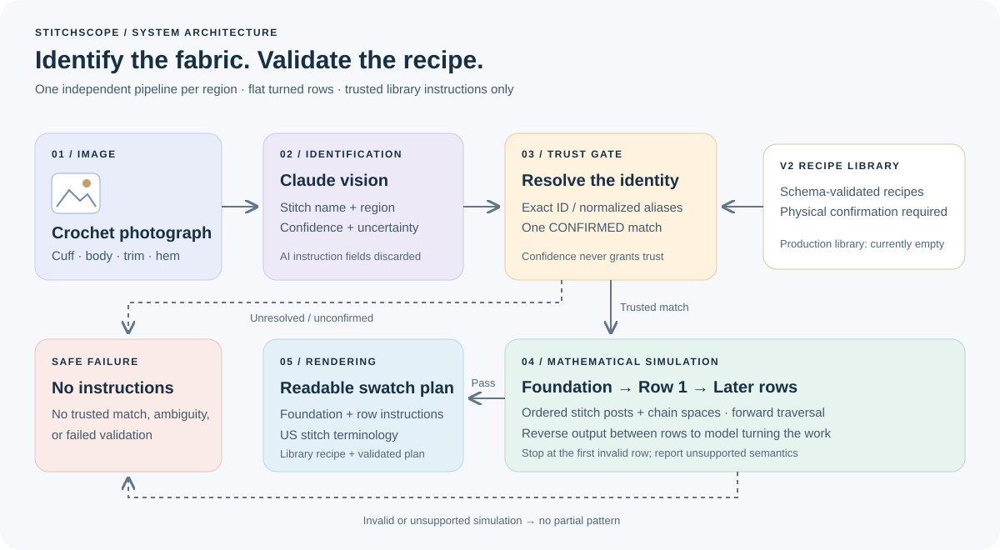

## StitchScope: Trusted Recipe Resolution & Row-by-Row Validation for Photo-to-Crochet Swatches.

Photographs of crocheted fabric offer an intuitive starting point for identifying stitch patterns, but recognizing a stitch does not establish the instructions needed to reproduce it. A vision model may identify a region as filet mesh while proposing an incorrect foundation, repeat, or turning chain. StitchScope addresses this gap by separating AI identification from recipe selection and mathematical validation. The pipeline first uses Claude to identify stitch families in individual image regions, returning structured names, confidence scores, and uncertainty rather than construction instructions. Each region is then resolved independently against a schema-validated v2 recipe library through deterministic name and alias matching. Only a stored recipe whose verification status is `CONFIRMED` is eligible for user-facing instructions; model confidence, name agreement, and successful simulation cannot confer physical confirmation.

For a trusted match, the planner calculates the foundation from the requested repeat count and executes Row 1 sequentially, retaining both aggregate counts and the ordered sequence of stitch posts and chain spaces it produces. Later rows traverse the preceding row's actual output with a moving cursor, distinguishing stitch types and spaces rather than treating equal totals as interchangeable. The output is reversed between flat rows to model turning the work, and repeat execution is derived from the available ordered targets. Validation stops at the first invalid row, while unsupported or ambiguous semantics are reported explicitly. Only a fully validated plan reaches the v2 renderer, which translates the selected library recipe into readable US-terminology instructions. AI-generated instruction fields are discarded, and failed resolution or simulation produces no partial pattern or fallback to the older pathway.

The current implementation supports repeat-based flat swatches with separate results for each identified region. Its production v2 library is intentionally empty pending actual physical confirmation, so live identification currently returns no trusted instructions. This makes the remaining challenge explicit: mathematical consistency can check whether a recipe's operations fit its available stitch structure, but cannot establish that the resulting fabric matches a photograph. Building a physically confirmed recipe collection is therefore necessary before the pipeline can provide usable patterns from real images. Gauge, physical sizing, four-inch measurements, garment construction, and continuous rounds are outside the current v2 pathway.

Link to [technical documentation](docs/recipe_model_v2.md).

---

## Contributors

- Keziah Aba Ghartey ([@gharteykeziah](https://github.com/gharteykeziah))
